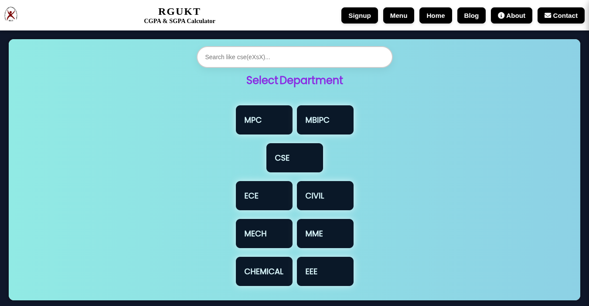
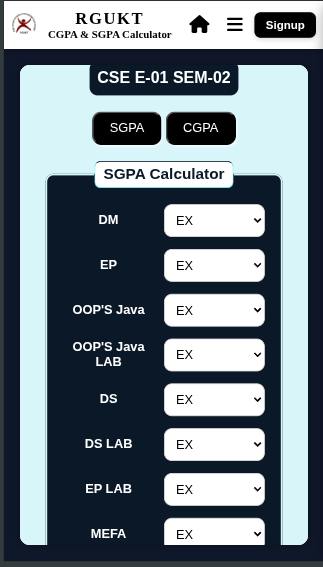
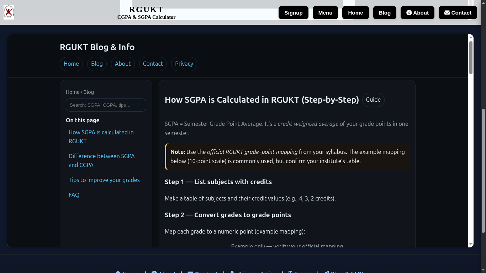

# 🎓 RGUKT SGPA & CGPA Calculator

A free, responsive web-based tool designed for **RGUKT students** to calculate their **SGPA (Semester Grade Point Average)** and **CGPA (Cumulative Grade Point Average)** easily and accurately.

---

## 🌐 Live Website
👉 **[https://www.rgukt-sgpa-cgpa-calculator.tech](https://www.rgukt-sgpa-cgpa-calculator.tech)**

---


## 🚀 Features

- 🧮 Calculate **SGPA & CGPA** for all branches — *CSE, ECE, EEE, CIVIL, MECH, PUC, etc.*
- 📱 Fully **responsive** for mobile, tablet, and desktop users
- 🎓 Supports **PUC & Engineering semesters**
- 🔐 **Firebase Authentication** (Signup / Login)
- 🌙 Modern **UI/UX** with gradient design and smooth animations
- 📰 **Blog & Info Section** for GPA tips, FAQs, and guides
- ⚡ **Fast-loading**, SEO optimized, and performance tested

---

## 🧩 Tech Stack

| Frontend | Backend | Hosting | Database |
|-----------|----------|----------|-----------|
| HTML5, CSS3, JavaScript (ES6 Modules) | Firebase Auth | Vercel | 

---


---

## 🖼️ Website Preview

### 🌟 Homepage  


### 🧮 SGPA Calculator  


### 📰 Blog Section  


---

## 🎞️ Scrolling Animation (Live Preview)

Here’s how the calculator flows and responds across devices:  


> 💡 **Tip:**  
> You can record your site’s animation using tools like:  
> - 🖥️ [ScreenToGif (Windows)](https://www.screentogif.com/)  
> - 💻 [RecordIt (macOS/Linux)](https://recordit.co/)  
> Save the result as `mobile-view.gif` inside  
> `assets/screenshots/` and commit it to your repo.

---

## 🧠 How to Run Locally

You must serve this project via a **local web server**  
(because it uses ES Modules + Firebase).

### ▶️ Option 1 — Using Python
```bash
cd RGUKT-SGPA-CGPA-Calculator
python3 -m http.server 8080


